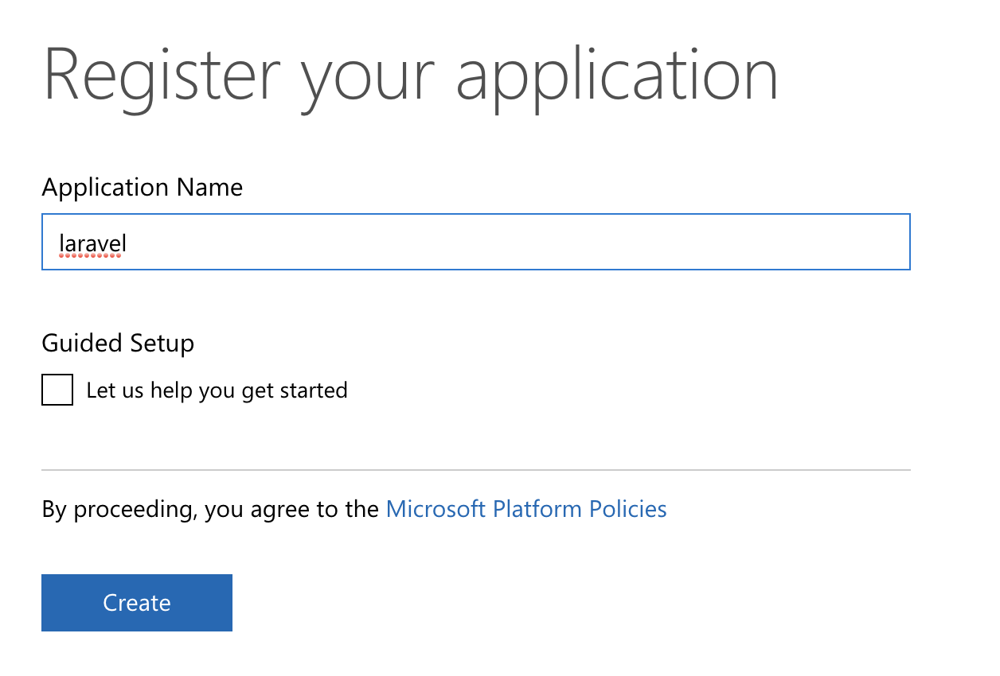
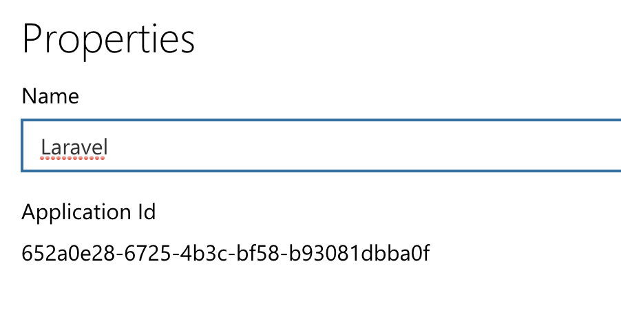
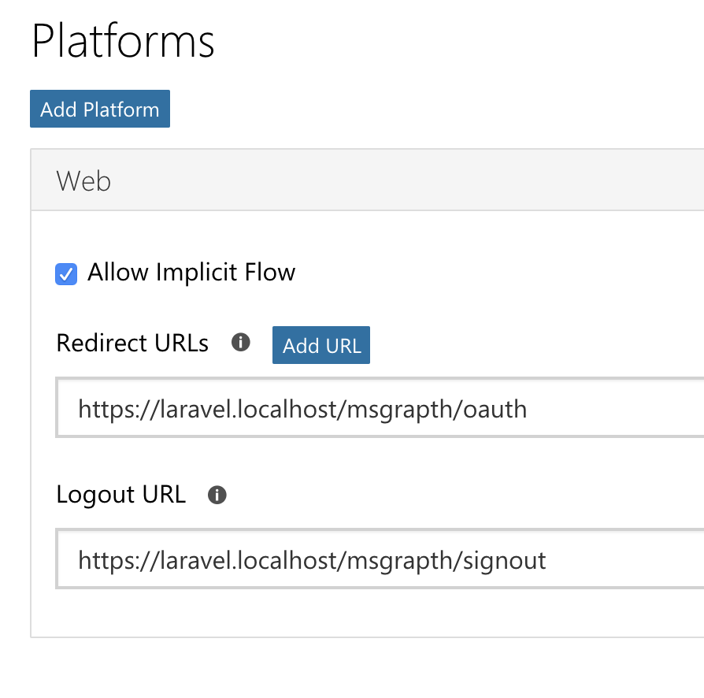
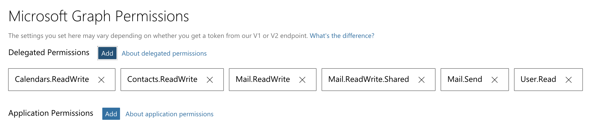

# Microsoft Graph API

A Laravel package for working with Microsoft Graph API, this includes authentication use Oauth2.

## Installation

To use Microsoft Grapth API an application needs creating at https://apps.dev.microsoft.com

Create a new application, name the application


click continue the Application Id will then be displayed.



Next click Generate New Password under Application Secrets it won't be shown again so ensure you've copied it and added to .env more details further down.

```
MSGRAPH_CLIENT_ID=
MSGRAPH_SECRET_ID=
```

Now click Add Platform under Platforms and select web



Enter you desired redirect url. This is the url you're application will use to connect to Graph API.

Now under Microsoft Grpaph Permissions click add and select which permissions to use, a maximum of 20 can be selected.



The other options are optional, click save at the bottom of the page to save your changes.


Via Composer

``` bash
$ composer require daveismynamelaravel/msgraph
```

In Laravel 5.5 the service provider will automatically get registered. In older versions of the framework just add the service provider in config/app.php file:

```
'providers' => [
    // ...
    DaveismynameLaravel\MsGraph\MsGraphServiceProvider::class,
];
```

You can publish the migration with:

php artisan vendor:publish --provider="DaveismynameLaravel\MsGraph\MsGraphServiceProvider" --tag="migrations"

After the migration has been published you can create the tokens tables by running the migration:

```
php artisan migrate
```

You can publish the config file with:

```
php artisan vendor:publish --provider="DaveismynameLaravel\MsGraph\MsGraphServiceProvider" --tag="config"
```

When published, the config/msgraph.php config file contains:

```
<?php

return [

    /*
    * the clientId is set from the Microsoft portal to identify the application
    * https://apps.dev.microsoft.com
    */
    'clientId' => env('MSGRAPH_CLIENT_ID'),

    /*
    * set the application secret
    */

    'clientSecret' => env('MSGRAPH_SECRET_ID'),

    /*
    * Set the url to trigger the oauth process this url should call return MsGraph::connect();
    */
    'redirectUri' => env('MSGRAPH_OAUTH_URL'),

    /*
    * set the url to be redirected to once the token has been saved
    */

    'msgraphLandingUri'  => env('MSGRAPH_LANDING_URL'),

    /* 
    set the authorize url
    */

    'urlAuthorize' => 'https://login.microsoftonline.com/common/oauth2/v2.0/authorize',

    /* 
    set the token url
    */
    'urlAccessToken' => 'https://login.microsoftonline.com/common/oauth2/v2.0/token',

    /* 
    set the scopes to be used, Microsoft Graph API will accept up to 20 scopes
    */

    'scopes' => 'offline_access openid calendars.readwrite contacts.readwrite files.readwrite mail.readwrite mail.send tasks.readwrite mailboxsettings.readwrite user.readwrite',

    /* 
    The default timezone is set to Europe/London this option allows you to set your prefered timetime
    */
    'preferTimezone' => env('MSGRAPH_PREFER_TIMEZONE', 'outlook.timezone="Europe/London"'),
];
```

Ensure you've set the following urls in your .env file:

```
MSGRAPH_CLIENT_ID=
MSGRAPH_SECRET_ID=
MSGRAPH_OAUTH_URL=
MSGRAPH_LANDING_URL=
```

Optionally add
```
MSGRAPH_PREFER_TIMEZONE=
```


## Usage

>Note this package expects a user to be logged in.

A routes example:

```

Route::group(['middleware' => ['web', 'auth']], function(){
    Route::get('msgraph', function(){

        if (!is_string(MsGraph::getAccessToken())) {
            return redirect(env('MSGRAPH_OAUTH_URL'));
        } else {
            //display your details
            return MsGraph::get('me');
        }
    });

    Route::get('msgraph/oauth', function(){
        return MsGraph::connect();
    });
});
```

Once authenticated you can call MsGraph:: with the following verbs:

```
MsGraph::get($endpoint, $array = [])
MsGraph::post($endpoint, $array = [])
MsGraph::put($endpoint, $array = [])
MsGraph::patch($endpoint, $array = [])
MsGraph::delete($endpoint, $array = [])
```

The second param of array is not always required, it's requirement is determined from the endpoint being called, see the API documentation for more details.

These expect the API endpoints to be passed, the url https://graph.microsoft.com/beta/ is provided, only endpoints after this should be used ie:

```
MsGraph::get('me/messages')
```


API documenation can be found at https://developer.microsoft.com/en-us/graph/docs/api-reference/beta/beta-overview

To make things a little easier there is also trait classes provided:

Each Trait class provides confinient methods that call the end points processes the data and returns json of the results.

Contacts
* contacts($limit = 25, $offset = 50, $skip = 0)

Emails
* emails($limit = 25, $skip = 0, $folderId = null) 
* emailAttachments($email_id)
* emailInlineAttachments($email)
* emailSend($subject, $message, $to, $cc, $bcc, $attachments = null)
* emailSendReply($id, $message, $to, $cc, $bcc, $attachments = null)
* emailSendForward($id, $message, $to, $cc, $bcc, $attachments = null)

These can be called directly:

List all emails (limited to 25):

```
MsGraph::emails();
```

You can optionally override the details set the limit to be 50 emails:

```
MsGraph::emails(50);
```

More trais will be added over the coming months.


## Change log

Please see the [changelog](changelog.md) for more information on what has changed recently.


## Contributing

Contributions are welcome and will be fully credited.

Contributions are accepted via Pull Requests on [Github](https://github.com/daveismynamelaravel/msgrapth).

## Pull Requests

- **Document any change in behaviour** - Make sure the `readme.md` and any other relevant documentation are kept up-to-date.

- **Consider our release cycle** - We try to follow [SemVer v2.0.0](http://semver.org/). Randomly breaking public APIs is not an option.

- **One pull request per feature** - If you want to do more than one thing, send multiple pull requests.

## Security

If you discover any security related issues, please email dave@daveismyname.com email instead of using the issue tracker.

## Credits

- [David Carr][dave@daveismyname.com]

## License

license. Please see the [license file](license.md) for more information.
